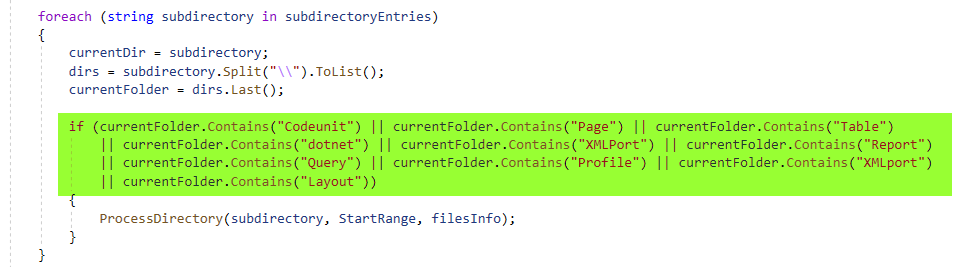
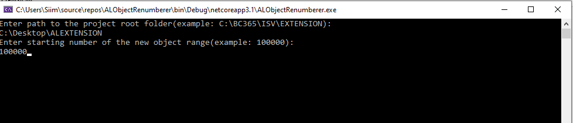
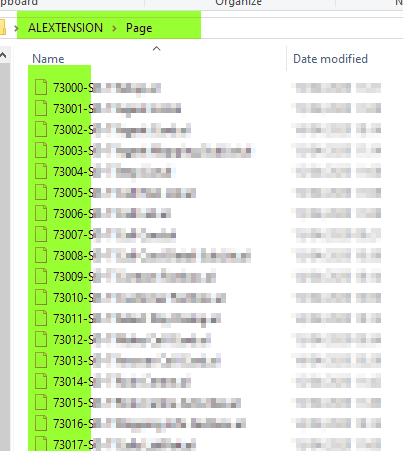
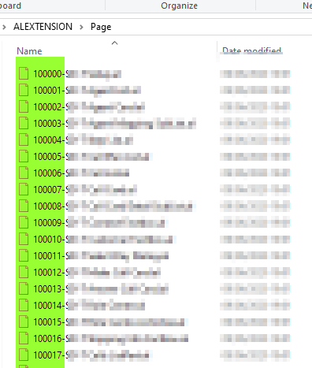
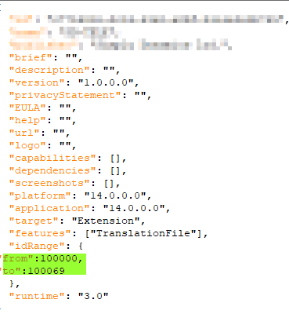

# .NET-AL-Object-Renumberer
C# application that renumbers all AL files with new user-defined object range on condition that all objects have their own file (not in a single file) and file-names have to start with the object range.

Why? As we know MS plans to replace the NAV era object ranges for BC in public version Azure cloud. This could mean a substantial amount of rather tedious work of manually renumbering. 

How it works? The Renumberer will recursively go through all of the sub-directories of the selected directory and renumbers any file that starts with number, given they reside in folder called Codeunit, XMLport, Page, Table etc - see below.

WARNING!!! Ensure the path provided on prompt is a project root folder. As the algorithm is recursive it can potentially cause harm to your files when providing a folder that isn't a project folder. Use at your own risk!

Step 1 - ENSURE TO BACKUP YOUR PROJECT FILES BEFORE RUNNING THE RENUMBERER

Step 2 - provide a path to your project root folder and the start number of the new object range.

Step 3 - compile the renumbered objects in VS Code to remove any compiler errors.

app.json from-to object range has also been modified.

Condition

CMD

Before

After

]

App.json

]
